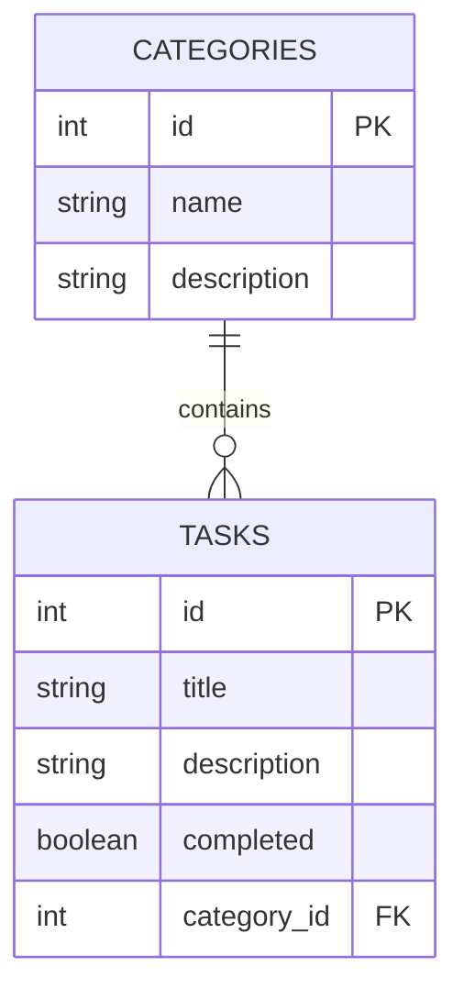

# Entity Relationship Diagram

```mermaid
erDiagram
    CATEGORIES ||--o{ TASKS : contains

    CATEGORIES {
        int id PK
        string name
        string description
    }

    TASKS {
        int id PK
        string title
        string description
        boolean completed
        int category_id FK
    }
```
